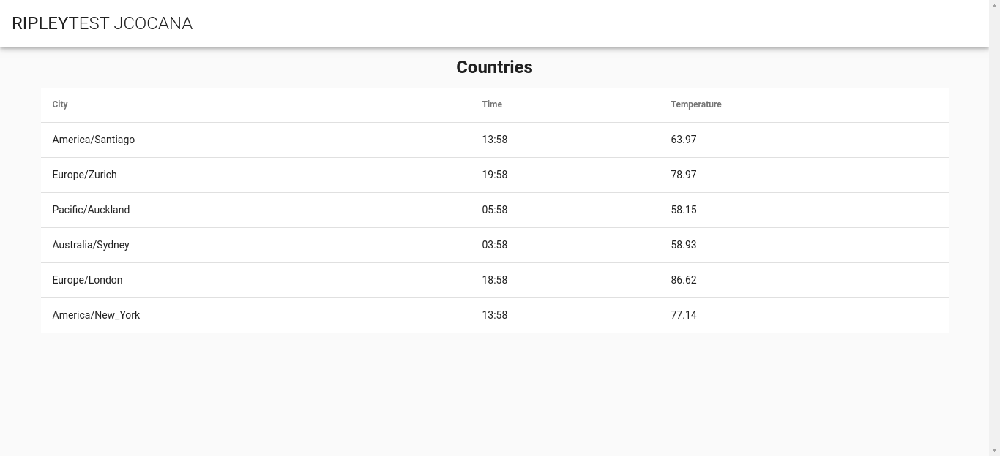

# ripley-test

El siguiente proyecto está hecho con el fin de consultar la hora actual y las temperaturas de las siguientes ciudades:
* Santiago (CL)
* Zurich (CH)
* Auckland (NZ)
* Sydney (AU)
* Londres (UK)
* Georgia (USA)

## Instalación y configuración
### Instale las dependencias del proyecto
```
npm install
```

### Compile el proyecto de Vue para producción
```
npm run build
```

### Agregue las variables de entorno
* **PORT:** Puerto por el que correrá el servidor de *Express JS* en caso de no configurar el puerto por defecto será **3000**.
* **API_KEY:** Token para consultar el api de *forecast.io* (https://darksky.net/dev/account).
* **REDIS_URL:** Url del servidor de Redis. En caso de no configurar este valor se pondrá por defecto la dirección local de su servidor local.

### Ejecute el proyecto
```
npm start
```

Ejecute la url http://localhost:3000 para ver su proyecto ejecutándose.

Si todo fue correcto le aparecerá una pantalla como esta:


### Ejemplo en ejecución
https://ripley-test-jcocana.herokuapp.com/

 